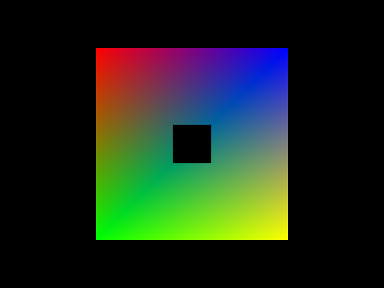

# OpenGLTest

## Prerequisite
1. brew install glew glfw3 glm
2. add /usr/include/local to header path in Xcode
3. add OpenGLFramework, libglfw, libGLEW to framework in Xcode

## Features
1. VAO, VBO
2. Stencil Features
3. FrameBuffer Features

## Effect

